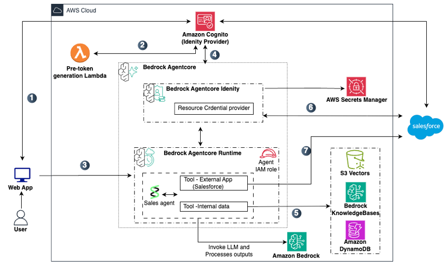

# Propagation of User Context in Agentic Applications Using Amazon Bedrock AgentCore

A reference solution showing how user identity propagates through AI agents on Bedrock AgentCore for user-scoped access, using Cognito as an IdP with custom claims and AgentCore Identity so that agents can only operate within that boundary without being given excessive authority. It covers AssumeRoleWithWebIdentity with session tags for AWS services, metadata filtering for Knowledge Bases, and On-Behalf-Of token exchange (RFC 8693, recently launched) for external services (using Salesforce as an example), with enforcement at the infrastructure layer rather than in agent code. The goal is to give customers a reference architecture for deploying agentic solutions on AgentCore with proper authorization boundaries.ity with session tags for AWS services, metadata filtering for Knowledge Bases, and On-Behalf-Of token exchange (RFC 8693, recently launched) for external services (using Salesforce as an example), with enforcement at the infrastructure layer rather than in agent code. The goal is to give customers a reference architecture for deploying agentic solutions on AgentCore with proper authorization boundaries.

## Architecture

<p align="center">
  
</p>

### Data Flow

1. User opens the chat application and authenticates with Amazon Cognito, which acts as the Identity Provider.
2. A Pre-token generation Lambda (V2) enriches the JWT tokens with a custom department claim and AWS session tag metadata before returning them to the user.
3. The Web App routes the user's request along with the JWT token to the agent deployed on Bedrock AgentCore Runtime.
4. Bedrock AgentCore Runtime validates the inbound JWT, issues a Workload Access Token binding user and agent identity, and invokes the agent.
5. For queries requiring internal documents, the agent uses its IAM role to query Amazon Bedrock Knowledge Bases (backed by S3 Vectors) with metadata filtering, and Amazon DynamoDB with user-scoped session-tagged credentials.
6. For queries requiring external data, Bedrock AgentCore Identity retrieves credentials from AWS Secrets Manager and performs On-Behalf-Of token exchange (RFC 8693) with Salesforce, returning a user-scoped access token.
7. The agent calls the Salesforce REST API using the user-scoped token. Salesforce applies sharing rules and returns only records the user is authorized to access.

## Prerequisites

- Python 3.11+
- Docker or [Finch](https://github.com/runfinch/finch) (for container builds)
- AWS CLI configured with appropriate permissions
- AWS account with access to Amazon Bedrock AgentCore
- Salesforce Connected App with Token Exchange (RFC 8693) enabled (for Pattern 3)

## How It Works

### Inbound Authorization (All Patterns)

1. User authenticates via Cognito → JWT access token includes `department` custom claim
2. Streamlit app sends `Authorization: Bearer <access_token>` + `X-Id-Token: <id_token>` to AgentCore Runtime
3. AgentCore Runtime's `customJWTAuthorizer` validates the access token:
   - Verifies signature via Cognito OIDC discovery URL
   - Checks `client_id` matches the allowed client
   - Checks `department` claim equals the expected department for this agent
4. If the department doesn't match → 401 (a Sales user cannot invoke the Finance agent)
5. Runtime calls `GetWorkloadAccessTokenForJWT` — binding the user's identity + agent's workload identity into a workload access token
6. Request is forwarded to the agent container with the workload access token in a header

### Pattern 1: DynamoDB (Zero-Trust Per-Request Credentials)

The agent holds **no standing DynamoDB permissions**. On every request:

1. Agent reads the user's ID token from the `X-Id-Token` header
2. Calls `sts:AssumeRoleWithWebIdentity` with the ID token against the shared `UserScopedDynamoDBRole`
3. STS validates the token against the registered Cognito OIDC provider
4. STS reads the `https://aws.amazon.com/tags` claim from the ID token and sets `aws:PrincipalTag/department` as a session tag
5. The role's policy restricts DynamoDB access: `dynamodb:LeadingKeys == ${aws:PrincipalTag/department}`
6. Agent queries DynamoDB with the scoped credentials — IAM enforces isolation even if the agent code passes a wrong department

### Pattern 2: Knowledge Base / S3 (Execution Role ABAC)

Each department's AgentCore execution role has a static S3 policy:

- Sales role: `s3:GetObject` only where `s3:ExistingObjectTag/Department == Sales`
- Finance role: `s3:GetObject` only where `s3:ExistingObjectTag/Department == Finance`

The Knowledge Base retrieval also applies a metadata filter (`Department == {department}`) as an application-layer check, with the IAM tag condition as an independent second layer.

### Pattern 3: Salesforce (AgentCore Identity On-Behalf-Of Token Exchange)

1. AgentCore Runtime automatically generates a **Workload Access Token** via `GetWorkloadAccessTokenForJWT` (carries both user identity and agent identity)
2. Agent code uses the `@requires_access_token(auth_flow="ON_BEHALF_OF_TOKEN_EXCHANGE")` decorator from the `bedrock-agentcore` SDK
3. The decorator calls `GetResourceOauth2Token` with the workload access token
4. AgentCore Identity sends an RFC 8693 token exchange request to Salesforce's token endpoint:
   - `grant_type = urn:ietf:params:oauth:grant-type:token-exchange`
   - `subject_token` = the user's identity (from the workload access token)
   - Client credentials from Secrets Manager
   - `actorTokenContent: NONE` (no separate actor token)
5. Salesforce returns an access token scoped to the resolved user
6. Agent queries Salesforce with department-scoped SOQL

No static Salesforce tokens are stored in the agent. AgentCore Identity handles token acquisition, caching, and refresh automatically.

## Project Structure

```text
├── app/
│   ├── main.py            # Streamlit UI (login, chat, JWT display)
│   ├── auth.py            # Cognito authentication (USER_PASSWORD_AUTH)
│   └── agent.py           # AgentCore Runtime HTTP client (Bearer token invocation)
├── agent/
│   ├── agent_server.py    # Agent code (FastAPI + Strands Agents + AgentCore Identity SDK)
│   ├── requirements.txt   # Agent dependencies (strands-agents, bedrock-agentcore, etc.)
│   └── Dockerfile         # Container image (python:3.11-slim, port 8080)
├── infra/
│   ├── template.yaml      # CloudFormation (Cognito, DynamoDB, S3, IAM OIDC, ABAC roles,
│   │                      #   AgentCore Identity credential provider)
│   └── parameters/
│       ├── dev.json
│       └── prod.json
├── scripts/
│   ├── deploy_agent.py    # Deploy per-department agents to AgentCore Runtime
│   ├── create_knowledge_base.py
│   ├── create_test_users.py
│   └── seed_demo_data.py
├── sample-docs/           # Sample department documents
│   ├── finance/           #   Q3 report, Q4 forecast, vendor payment policy
│   └── sales/             #   Competitive analysis, enterprise playbook, pipeline report
├── .env.example
└── README.md
```

## Setup

### 1. Deploy Infrastructure

```bash
aws cloudformation deploy \
  --template-file infra/template.yaml \
  --stack-name crmhub \
  --capabilities CAPABILITY_NAMED_IAM \
  --parameter-overrides \
    Environment=dev \
    SalesforceInstanceUrl=https://your-instance.my.salesforce.com \
    SalesforceClientId=your-client-id \
    SalesforceClientSecret=your-client-secret \
  --region us-east-1
```

This creates:
- **Cognito User Pool** with V2 Pre-Token Generation Lambda (injects `department` claim into both ID and access tokens, plus `https://aws.amazon.com/tags` claim for STS session tagging)
- **IAM OIDC Provider** for the Cognito User Pool (enables `AssumeRoleWithWebIdentity`)
- **UserScopedDynamoDBRole** — a shared role assumed per-request via the user's ID token; STS converts the tags claim into `aws:PrincipalTag/department` and IAM's `LeadingKeys` condition scopes DynamoDB access
- **Per-department execution roles** (Sales, Finance) with S3 ABAC policies (`ExistingObjectTag/Department`) and AgentCore Identity permissions
- **DynamoDB table** (`CustomerHubData-{env}`) for structured department records
- **S3 bucket** for Knowledge Base documents (tagged by department)
- **AgentCore Identity OAuth2 Credential Provider** for Salesforce (Token Exchange / On-Behalf-Of flow via RFC 8693)
- **Secrets Manager secret** for the Salesforce client secret

### 2. Configure Environment

```bash
cp .env.example .env
```

Fill in values from CloudFormation outputs:

```bash
aws cloudformation describe-stacks \
  --stack-name crmhub \
  --query 'Stacks[0].Outputs' \
  --output table
```

Key values to populate:
- `COGNITO_USER_POOL_ID`, `COGNITO_APP_CLIENT_ID`
- `AGENTCORE_AGENT_ARN_SALES`, `AGENTCORE_AGENT_ARN_FINANCE` (after step 6)
- `KNOWLEDGE_BASE_ID` (after step 3)
- `SALESFORCE_PROVIDER_NAME` (from CloudFormation output `SalesforceProviderName`)
- `SALESFORCE_INSTANCE_URL`

### 3. Create Knowledge Base

```bash
pip install -r requirements.txt
python scripts/create_knowledge_base.py
```

### 4. Seed Demo Data

```bash
python scripts/seed_demo_data.py
```

### 5. Create Test Users

```bash
python scripts/create_test_users.py
```

Creates users with department assignments (Sales, Finance).

### 6. Deploy Agents to AgentCore Runtime

```bash
python scripts/deploy_agent.py --env dev
```

This builds the container image, pushes to ECR, and deploys two department-specific agents — each with:
- Its own IAM execution role (department-scoped S3 access + AgentCore Identity permissions)
- A `customClaims` JWT authorizer that rejects tokens where `department != expected`
- A `requestHeaderConfiguration` that allowlists the `X-Id-Token` header (for forwarding the Cognito ID token to the agent)
- Environment variables including `USER_SCOPED_DYNAMODB_ROLE_ARN` and `SALESFORCE_PROVIDER_NAME`

Update `.env` with the agent ARNs from the output.

### 7. Run the App

```bash
streamlit run app/main.py
```

## Cleanup

```bash
# Delete agents (via deploy_agent.py --delete or AWS Console)
# Delete ECR repository
aws ecr delete-repository --repository-name customerhub-agent-dev --force --region us-east-1

# Delete CloudFormation stack
aws cloudformation delete-stack --stack-name crmhub --region us-east-1

# Delete Knowledge Base (via AWS Console or CLI)
# Delete Cognito users (via AWS Console or CLI)
```
